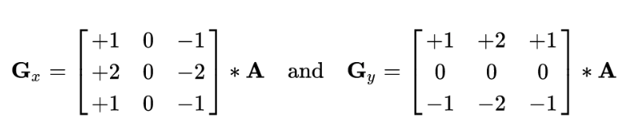

# GPIX: Plant Cover Calculation Accelerated With GPUs

#### By Bashar Al-Habash, Bruce Englert, and Jakob Johnson

## Background and Motivation

Much plant physiology research involves growing plants under various conditions and evaluating their growth or yield to determine how the plant grows if the conditions change. Farmers in production fields also do similar experiments, changing fertilizer and other variables and measuring the plant’s response. In order to measure a plant’s growth, the two common metrics currently used are plant mass and plant leaf area, both of which require a destructive harvest, and leaf area requires an expensive measuring device. Our project’s goal is to provide a metric for plant growth that does not require killing the plant, enabling faster and cheaper measurements and the ability to take multiple measurements in time on a single plant. 

## Related Work

Previous work was done in a sequential approach using a mixture of Photoshop’s select-and-mask tool combined with a python script to calculate the percentage of the image covered [4]. Various previous studies have been performed prior. One in particular relied on the implementation of 15 parallel thresholding algorithms to process plant growth [1]. One prior work used the  Delaunay algorithm (a triangular method that produces a mesh) to model and subsequently render for recognition analysis. Also work was done for the specific recognition of plants native to Africa using the Otsu thresholding algorithm [3]. Our work differs in that we apply multi stage algorithms based on the Canny Edge Detector and Laplacian Second-Order Edge Detector in order to capture only the outline of the plant in the image. 

## Project Description

Our project will analyze photos of plants in order to find their surface area and mass. We will be utilizing a sample of 12 top down plant photos with a known background size and leaf surface area to test the accuracy of our results and compare different edge detection algorithms. To find our results, we will be counting the number of green pixels in our plant images in order to calculate the leaf area. However, before counting the green pixels we will be using edge detection algorithms to get a more accurate capture of the plant’s leaf area. By removing the edge pixels from our green pixel counting algorithm, we are able to get a closer representation of the real surface area of the leaves. Three different edge detection algorithms will be analyzed and compared on their performance in runtime and accuracy of results. Lastly, we will discuss the relationship between counted green pixels and real leaf area and determine how well this method works at determining plant area.

## Edge Detection

We chose to implement three different edge detection algorithms to outline the plant and aid in the plant pixel counting. As the plant pixel counting algorithm requires a color image, all three edge detectors read in an array of red/green/blue pixels and convert them to a grayscale image for analysis. In this use-case we chose to simply use the green channel but it could be easily generalized to a weighted average of the colors to “detect” on any color if the plant in question was not green.

The algorithms return their results in the form of a boolean array, allowing for significantly reduced memory usage compared to an integer array.

## Canny Edge Detector
The Canny Edge Detection Algorithm is implemented in our project in 5 stages: noise reduction, gradient calculation, non-maximum suppression, high thresholding, and hysteresis edge tracking. Specific stages in the algorithm were optimized in certain ways for prioritizing the trace of the plant’s outer edges. 

	Noise Reduction: To reduce the harder edges in the image an gaussian blur is applied to each image. A 7x7 gaussian mask is first created and applied to the RGB pixels of the original image. For each position of the gaussian mask the following equation is used to calculate its value: 
mask[x][y] = $\frac{1}{\sqrt{2\pi}\sigma} e^{\frac{-x+y}{2\sigma^2}}$ 

	Gradient Calculation: The image is converted from the gaussian blur to a grayscale image using magnitude of the variation between the pixels above (∆x) and below (∆y) the one being calculated upon. A greater weight is given to green pixels in this stage. 


    Non-maximum Suppression: Edges the gradient calculations are thinned out using the ∆x and ∆y values from the previous stage. For each pixel analyzed the surrounding pixels with high magnitudes from ∆x or ∆y are then suppressed, thinning out thick edges from the gradient image. 

    High Thresholding: In this stage pixels that are above a threshold are marked as a strong edge. Weak edges are ignored. 

    Hysteresis Edge Tracking: For each pixel previously marked as a strong edge all surrounding pixels are analyzed. If any of the surrounding pixels meet a lower threshold mark then they are marked as a strong edge. 

The final result is a boolean matrix of pixels defined as strong edges. 

## Laplacian Second-Order Edge Detector

The Laplacian edge detection uses the second derivative of an image which is the gradient of the first derivative curve. When the second derivative crosses zero, we mark it as an edge and for this reason is sensitive to noise.  A sharp change in intensity is not always an edge and that is why we use the method Laplacian of Gaussian (LoG) [5], which applies a Gaussian smooth filter, in order to solve this issue. After the first step, applying the Gaussian filter, we are able to apply the Laplacian edge detection using an approximation kernel which is convolved with a grayscale version of the image to detect the zero crossing of the second derivative.

	Gaussian Blur: This filter is used to reduce the noise of false-positive edges, and uses a 7x7 gaussian mask on the original image. The same filter is also used in the Canny edge detection algorithm in its first step.

	Laplacian Filter: After reducing the noise we used a 7x7 approximation kernel to apply our filter. We first take the blurred version we have of the image and convert it to a grayscale version in order to apply our edge detection. From here, we go through the pixels of the image and calculate the sharp change in the area of our kernel around the current pixel. Finally, we set a threshold to find the zero crossing of the second derivative and keep the strong zero crossings that exceed that threshold, ignoring the rest as noise. 

## Sobel Edge Detector
The Sobel edge detector is a simple first-order gradient approximation algorithm using two 3 x 3 kernels to approximate horizontal and vertical changes in the color gradient in the image. Where A is the input image, the kernels are



Due to its simplicity however,it is a poor approximation of the gradient and leads to very noisy edge detections. We chose this algorithm because it was very simple to implement and it’s simplicity means it can run very fast when parallelized on a GPU. 

## Green Pixel Counting

After the image of the plant was sent through one of the three edge detectors, the image array and boolean edge array are then sent to the green pixel counting kernel. At its most basic, the algorithm is as follows


```
// loop over all pixels in image
if(green-threshold > red && green-threshold > blue){
    // mark pixel as detected
    // increment detected count
}
```

Where ‘threshold’ is a constant to tweak, controlling how “green” a pixel needs to be before it is detected as a plant. This was included because the green cast from the plant reflecting on the pot caused it to be detected as a plant often, a threshold value of 10 is best in most cases (red/green/blue range from 0 to 255). 


After the kernel finishes running, it returns an edited image array coloring detected pixels red and a count of the number of total pixels detected. The image array can then be converted back into a ppm to allow for debugging and diagnostics, showing areas we missed and areas we wrongly detected. The pixel count can then be converted to cm2 as we know the size of the pot in each image and can calculate a conversion ratio. The cm2 data can then be compared to the real recorded leaf area of the plants to judge the green pixel counter algorithm’s accuracy. 

The kernel was optimized so each thread can compute the count for an arbitrary 2D grid of pixels. We calculated the average color over the grid and marked all pixels either “plant” or “not”. Originally we thought this would be an accuracy for speed tradeoff, but after runtime and accuracy analysis, we found that accuracy stayed relatively constant while runtime actually increased as we increased the grid size. Our algorithm must be computationally bound and any vectorization gains made from the unrolling must have been cancelled out. This method might be useful if we had a much larger image, ours were 750 x 750 px, or if we chose not to build the output image, where there is a significant amount of control-flow code in order to mark pixels as red, white, or leave them the original color.

We took the grid code a step further and implemented dynamic parallelization, first breaking the image into 16x16 pixel grids and calculating the number of detected edge pixels inside that grid. If that number exceeded a chosen threshold, then a second kernel launch would happen within the thread, doing pixel-by-pixel counting on the edges. We chose this method because in most pictures there will be large areas of either all leaf or all not leaf where we can quickly move over. 

Dynamic Parallelism did not help runtime, in fact it made the program significantly slower due to the additional control flow in counting edge pixels and kernel launching overhead, but this method would also show more of an impact on very large images or more complex images. We compared the runtime and accuracy across the three edge detection algorithms and found some interesting results. Accuracy stayed essentially constant yet runtime changed significantly. Pixel count using Canny edges ran the quickest, followed by Laplacian, with Sobel in last. In the next figures you can see the darker red areas where the pixels were counted in the child kernel. Canny did a better job isolating the real edges of the plant whereas the others found many artifacts in and around the plant that caused runtime to significantly decrease as child kernel calls increased. 


Sobel was the fastest edge detection algorithm, but due to it’s noisy detection it produced the worst actual edge estimate, where Canny and its ability to be optimized to the edges of the plant produced a far superior edge estimate. 

In future research, a recursive implementation of the algorithm might be best. Also, we might be able to increase our runtime by implementing some linear algebra-based methods for counting edges and averaging over the 16 x 16 px grid. 

## Results

We saw a huge benefit in speed moving the algorithm to the GPU from sequential execution. The pixel count algorithm was 33 times faster, and the edge detection algorithms were between 355 and 1242 times faster. Note that in the figure to the right, the Canny and Laplacian sequential runtimes are way off scale (600 and 900 ms). We saw such a huge speedup because our one large problem was easily broken into many smaller problems, following Amdahl’s law, and because algorithms are computationally-bound with very little memory movement. 


We ran our program on 12 different plant images, all of the same variety of lettuce but with various leaf sizes due to a treatment applied during growing. For each of these plant images we were given the leaf area measured using a leaf area scanning device to compare our measurements to. Using the known size of the pot, we converted detected pixels to cm2 surface area. Plotting this versus the actual value gives the following graph. 


From this, we can see that there is a very high correlation between calculated and actual leaf area, even if some of the leaf is hidden from the image. The algorithm captures roughly 25% of the total leaf area, meaning that it can’t replace a leaf area measurement but we can use it to strongly predict real leaf area or be used as a leaf area or growth metric, accomplishing our goal of creating a method to quickly and easily analyze images to give an estimate of plant growth. 

Future work could be done making the algorithm more robust on different size images or images with a more messy background. Also, import/export of jpegs would save a lot of time as .ppm files are unsupported by many image viewers and cameras. 

## References

[1] A. Ozdemir and T. Altilar, "GPU based parallel image processing for plant growth analysis," 2014 The Third International Conference on Agro-Geoinformatics, Beijing, China, 2014, pp. 1-6, doi: 10.1109/Agro-Geoinformatics.2014.6910629.

[2] Huai Yongjian, Li Jingli, Wang Lichen, and Yang Gang. "Plant Leaf Modeling and Rendering Based-On GPU." 2009 First International Conference on Information Science and Engineering (2009): 1372-375. Web.

[3] Winberg, Simon, Naidoo, Khagendra, & Ramone, Moeko. (2017). “Accelerating computer-based recognition of fynbos leaves using a Graphics Processing Unit.” South African Computer Journal, 29(3), 238-262. https://dx.doi.org/10.18489/sacj.v29i3.432

[4] https://github.com/jakobottar/green-pixel-analysis

[5] Laplacian of Gaussian Filter (LoG), https://academic.mu.edu/phys/matthysd/web226/Lab02.htm
