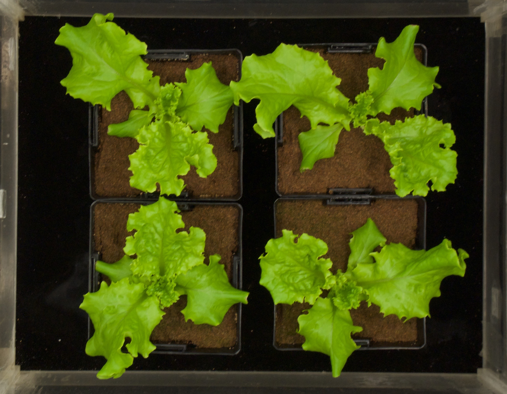

# GPIX, Plant Area Calculation Accelerated with GPUs

CS 6325 - Parellel Programming Project
## Team members: Name and a sentence on expertise for each member

Jakob Johnson ([email](mailto:jakob.johnson@utah.edu)) - Prior experience in statistics and greenhouse studies.

Bruce Englert ([email](mailto:englert.bruce@utah.edu)) - Prior experience multi-thread processing. 

Bashar Al Habash ([email](mailto:u1067631@utah.edu))   - Prior experience in computer graphics

## Problem description

### What is the computation and why is it important?

In this project, we will analyze photos of plants to determine their mass and surface area.
A plant's leaf surface area and it's mass are highly correlated, as much of a small plant's mass 
is the leaves, and it is of great use to farmers and greenhouse managers to see how well 
their plants are doing, and if they're on-track to meet a certain production target. 
Normally when you want to measure a plant's mass, you have to kill it in order to weigh just the leaves 
or stems or both. Also, measuring surface area requires complicated expensive machinery that also requires killing the plant. 

If we can come up with a way for a farmer or a greenhouse grower to calculate the mass of the 
plant with a photo and a size guide, then that can be used to quickly determine the plant's health 
and growth nondestructively, and open up opportunities for research were a plant's mass is taken 
repeatedly over time more easily than previously available.  

This kind of calculation has been done in the past with simple counting of green pixels in an image. 
We would like to extend that and use edge detection algorithms to better capture all of a plant's leaf area. 

Once this works on green plants, it could be extended to a whole host of applications like medicine
where a doctor could determine the size of a tumor quickly from an X-ray or MRI. 

### Abstraction of Computation

We've already seen the Sobel edge detection algorithm, so we would like to implement a couple 
more edge detection algorithms and compare their performance both in runtime and correctness. 

We have some sample photos of plants from the top down with a known size background, along with their measured leaf areas. 
We can use this to compare the results from the edge detection images to. 

First we'll count up the number of pixels that are green (majority G in RGB space), and/or are close to a chosen color. 
This will serve as a "control" as well as aid in the detection of plant vs not plant when we are filling in the edges on
the edge detection versions. 

We'll then re-implement the Sobel edge detection algorithm, as we have experience with it before.

Then We'll implement another simple edge detection algorithm, the Canny edge detector. This edge detector works by applying a Gaussian filter, then the edge pixels are chosen by computing the gradient at that point.   
[Canny Edge Detector](https://en.wikipedia.org/wiki/Canny_edge_detector)

Finally, we'll implement a more complicated edge detector, a second order-based method   
[Second-Order Method](https://en.wikipedia.org/wiki/Edge_detection#Second-order_approaches)

If we have time I would also like to implement a sub-pixel based method, as some of these photographs might be small 
and pixelated, or we can shrink down the image size for faster calculation but maintain the accuracy.  
[Subpixel Method](https://en.wikipedia.org/wiki/Edge_detection#Subpixel)

## Suitability for GPU acceleration

### Amdahl’s Law: describe the inherent parallelism. Argue that it is close to 100% of computation. Use measurements from CPU execution of computation if possible.

In our proposed project there will be many plant images that need their area calculated for greenery. The computations that we hope to explore in calculating the area of greenery does not care about the size of the image. Therefore the group of images can be split into individuals and these individual images can further be split into domain for computation of processing cores. Thus the majority of the algorithm allows for parallelism as the main problem at hand can be systemically divided into smaller computations. 

### Synchronization and Communication: Discuss what data structures may need to be protected by synchronization, or communication through host.

In our problem the host acts as the orchestrator, splitting up the image down for device computation. Each device will need to have access to its respective partition of the image. Thus we'll have a protected 2D array of the pixels for each device. The device is only responsible for  returning the calculated area for its supplied image partition. From each device the host expects to receive an area. 

### Copy Overhead: Discuss the data footprint and anticipated cost of copying to/from host memory.

The overhead cost of copying is determined by the size of the image being calculated as it needs to be sent to the device for computation. Right now the plan is to have each device return its computed area to the host which has the added cost of copying values into host memory which then need to be summed up. A point of curiosity to explore if the host performing the summation is faster than parsing the workload out. 

## Intellectual Challenges

### Generally, what makes this computation worthy of a project?

The general uses of such an image processing program are countless. While we are only addressing image processing to find the surface area and mass of a plant, this provides research for other image processing applications that use edge detection and parallel programming. Moreover, we believe that this project is very practical and has potential future uses for any farmer/plant care taker.

### Point to any difficulties you anticipate at present in achieving high speedup

Our main concerns is addressing the best edge detection methods, while we are not sure about the accuracy of each of them, and the effect that has on the practicality of our program. We want to minimize the error in false positive edge detection and find the most accurate and fastest solution possible. This is a common concern and problem found in most image processing application, and we hope that our project will be able to provide future projects research regarding edge detection methods and their running times. 
